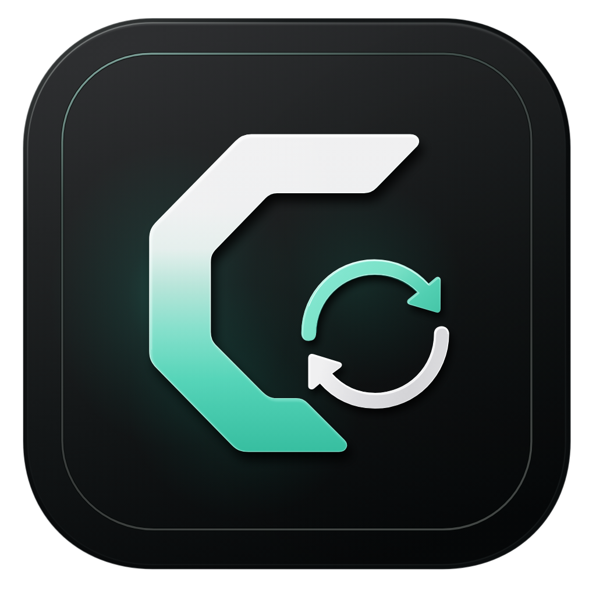
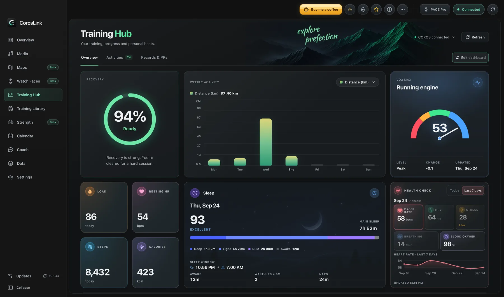
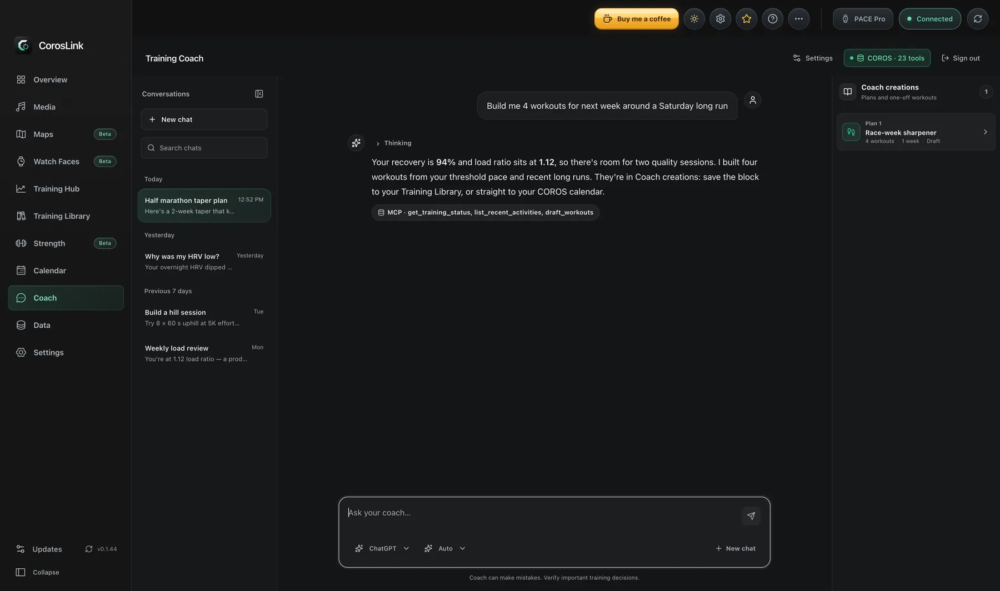
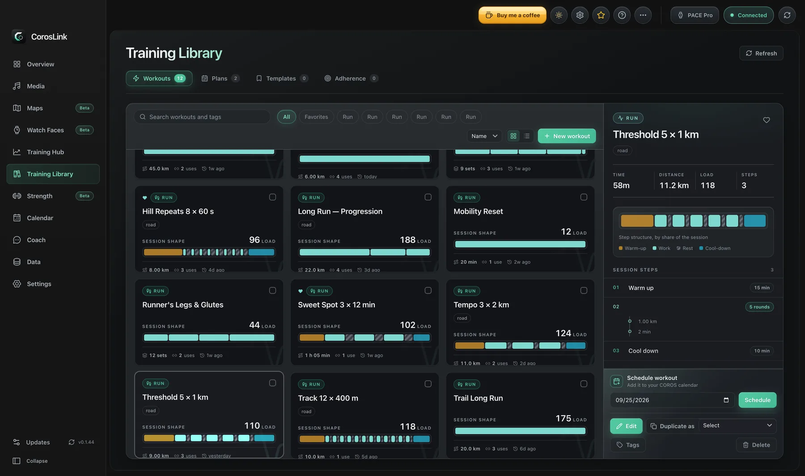
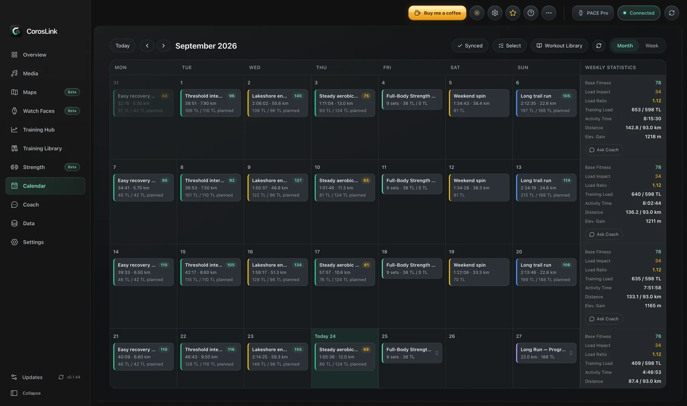
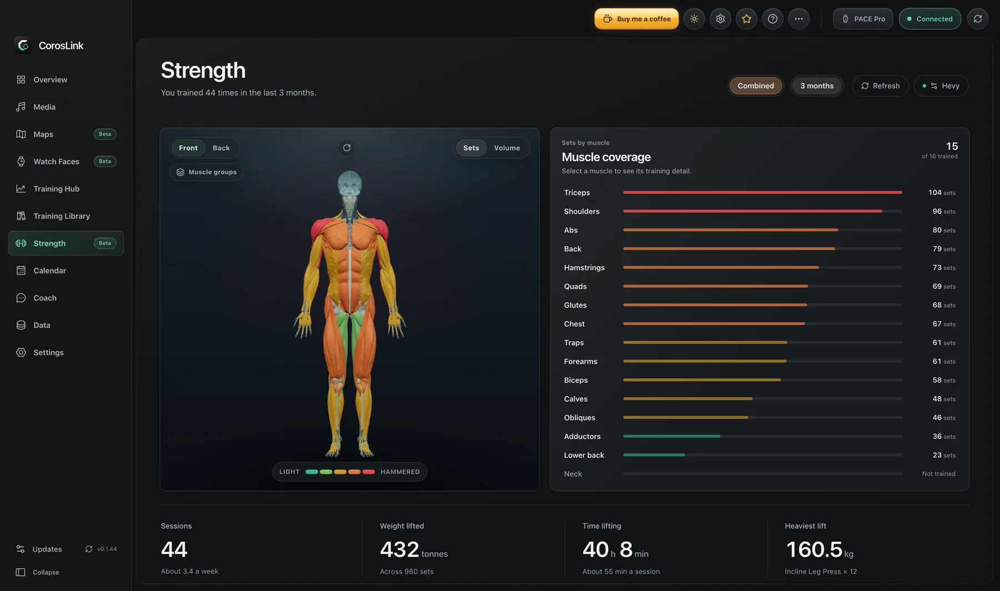
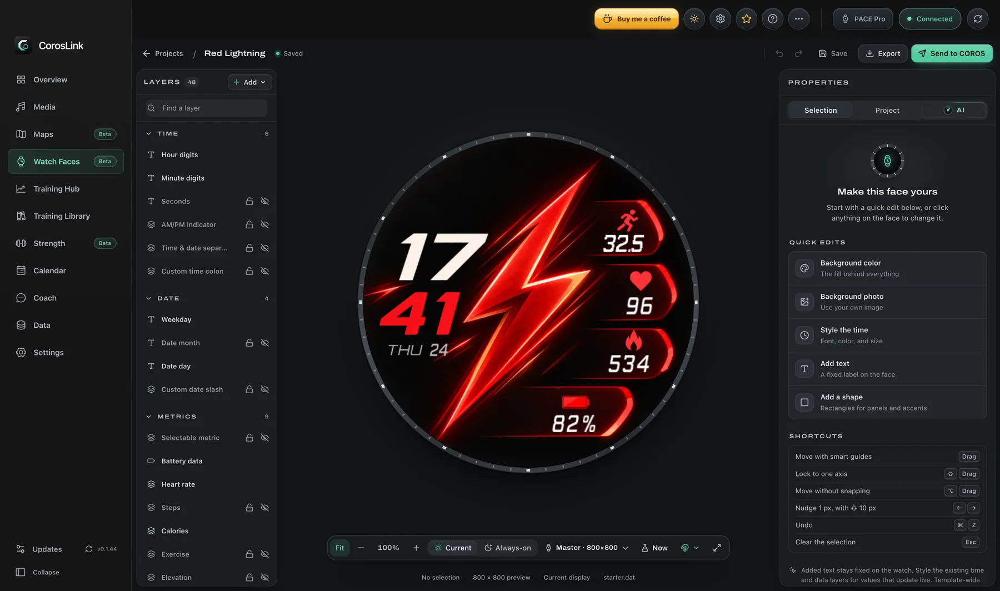
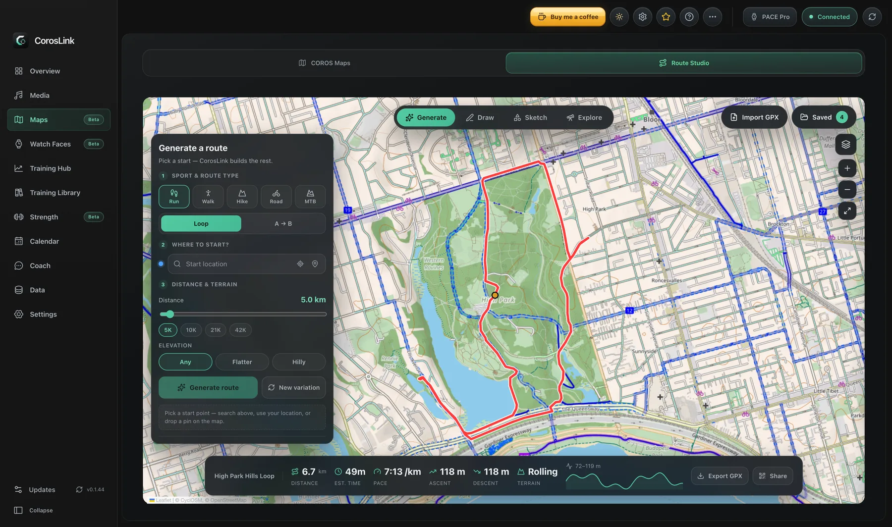
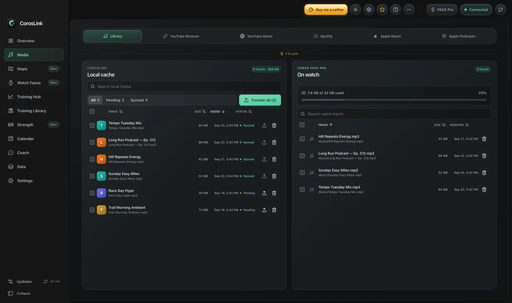

<p align="center">
  
</p>

<h1 align="center">CorosLink</h1>

<p align="center">
  <em>Your COROS watch companion — music, maps, watch faces, and training analytics on desktop.</em>
</p>

<p align="center">
  <a href="https://github.com/JunAkerBuilds/CorosLink/releases"><strong>Download</strong></a> ·
  <a href="https://coroslink.com/">Website</a> ·
  <a href="https://docs.coroslink.com/">Docs</a> ·
  <a href="https://www.buymeacoffee.com/addridoa">Buy me a coffee</a>
</p>

<p align="center">
  
  
  
  
</p>

<p align="center">
  <picture>
    <source media="(prefers-color-scheme: light)" srcset="docs/screenshots/training-light.webp" />
    
  </picture>
</p>

<p align="center">
  <sub>Unofficial desktop app for COROS watch owners. Not affiliated with or endorsed by COROS.</sub>
</p>

---

## Features

### Training Hub & Coach

Sign in with your COROS account to see recovery, training load, HRV, sleep, EvoLab scores, race predictions, and full activity detail — then ask the **Coach** about it.

- Coach runs on ChatGPT, Claude Code, OpenRouter, or local models (Ollama, LM Studio, or any OpenAI-compatible server on your network)
- Draws charts on request and pins them to the Training Hub, where they refresh with live data
- Deep analysis from a local FIT-file index: splits, power curve, best efforts, route comparisons
- Drafts workouts and multi-week plans — nothing is written to COROS until you confirm
- Bulk-export your activities (FIT, GPX, TCX, KML, CSV) or import from intervals.icu

<p align="center">
  <picture>
    <source media="(prefers-color-scheme: light)" srcset="docs/screenshots/coach-light.webp" />
    
  </picture>
</p>

### Training Library & Calendar

Build, schedule, and reuse training — from one structured workout to a full multi-week plan.

- Workout library with a sport-aware builder, tags, collections, and step previews
- Local training plans with drag-and-drop weeks, phases, templates, and plan comparison
- Planned-vs-completed adherence with automatic activity matching
- Month/week calendar with drag-to-reschedule, synced to **Google** or **Apple Calendar** ([Google](docs/google-calendar-sync.md), [Apple](docs/apple-calendar-sync.md))

<p align="center">
  <picture>
    <source media="(prefers-color-scheme: light)" srcset="docs/screenshots/library-light.webp" />
    
  </picture>
  <picture>
    <source media="(prefers-color-scheme: light)" srcset="docs/screenshots/calendar-light.webp" />
    
  </picture>
</p>

### Strength

A rotatable 3D muscle map that shades each muscle by how hard you've worked it, plus weekly volume trends, push/pull/legs balance, per-exercise PRs and estimated 1RM. Optional **Hevy** sync merges your Hevy workouts with COROS strength history.

<p align="center">
  <picture>
    <source media="(prefers-color-scheme: light)" srcset="docs/screenshots/strength-light.webp" />
    
  </picture>
</p>

### Watch Face Studio (experimental)

Design custom COROS watch faces in a layer-based editor — fonts, colors, artwork, live metrics, and an always-on variant — then hand it off to the COROS app via QR. Browse and remix community faces, or let the built-in AI make edits for you.

<p align="center">
  <picture>
    <source media="(prefers-color-scheme: light)" srcset="docs/screenshots/studio-light.webp" />
    
  </picture>
</p>

### Maps & Routes (beta)

- Download official COROS Landscape/Topo map regions and install them over USB
- Generate loop or point-to-point routes (OpenRouteService), or import GPX from Strava, Komoot, etc.
- Elevation profile, pace estimates, GPX export, and QR share to the COROS phone app

<p align="center">
  <picture>
    <source media="(prefers-color-scheme: light)" srcset="docs/screenshots/routes-light.webp" />
    
  </picture>
</p>

### Music & Podcasts

Get MP3s onto your watch over USB from **YouTube**, **Spotify**, **YouTube Music**, **Apple Music**, **YouTube playlists**, or public **Apple Podcasts** episodes. Streaming-service tracks are matched on YouTube and downloaded with yt-dlp + ffmpeg. See [music integrations setup](docs/music-integrations.md).

**Audiobooks** — import a DRM-free `.m4b`, `.m4a`, `.mp3`, or similar file (or several files to join them) and CorosLink splits it into 10-minute mono MP3 parts named in play order. COROS watches play MP3 only and don't remember your place inside a track, so short parts limit how much you lose and turn the skip button into a 10-minute jump. Parts are copied one at a time, first to last, because the watch plays files in the order they were transferred.

<p align="center">
  <picture>
    <source media="(prefers-color-scheme: light)" srcset="docs/screenshots/media-light.webp" />
    
  </picture>
</p>

---

## Install

Grab the latest installer from **[GitHub Releases](https://github.com/JunAkerBuilds/CorosLink/releases)**. After that, updates arrive in-app.

| Platform              | File                          |
| --------------------- | ----------------------------- |
| macOS (Apple Silicon) | `CorosLink-*-arm64.dmg`       |
| macOS (Intel)         | `CorosLink-*-x64.dmg`         |
| Windows               | `CorosLink Setup *.exe`       |
| Linux (x64)           | `CorosLink-*-x86_64.AppImage` |

- **macOS** builds are signed and notarized. If an older or self-built copy says it's damaged, run `xattr -cr "/Applications/CorosLink.app"`.
- **Windows** may show SmartScreen — click **More info → Run anyway**.
- **Linux**: `chmod +x CorosLink-*.AppImage`, then run it.

Everything beyond USB music/map sync is optional and needs only what you use: a COROS account (Training Hub, Coach), an OpenRouteService key (routes), an OpenRouter key or local LLM (Coach), Spotify/Google OAuth apps, or Python 3.10+ with `ytmusicapi` (YouTube Music).

---

## Privacy

CorosLink is local-first and runs no backend of its own.

- Music, maps, activity caches, and settings live on your machine (SQLite + files on disk).
- Tokens and passwords are stored locally; sensitive ones are encrypted with the OS keychain.
- Data only leaves your machine for the service you're using: COROS (training data), Spotify/Google/Apple (your library or calendar), OpenRouteService (routes), or the AI provider you pick for Coach.
- Watch-only recordings can't be read — a workout must sync to your COROS account first.

> Only download media you have the rights or permission to download.

---

## Development

```sh
git clone https://github.com/JunAkerBuilds/CorosLink.git
cd CorosLink
npm install
npm run rebuild   # native SQLite bindings for Electron
npm run dev       # Vite on :5173 + Electron; fetches yt-dlp/ffmpeg on first run
```

- Test watch detection without hardware: `COROS_WATCH_PATH=/path/to/mock-watch` (with a `Music` folder) or `npm run smoke:watch`.
- Icon source is `build/icon.svg`; regenerate with `npm run icons:generate`.
- Build installers with `npm run dist:mac` / `dist:win` / `dist:linux` (on the matching OS). Packaging and release steps are in [docs/releasing.md](docs/releasing.md).

---

<p align="center">
  Built with Electron, React, and Vite · CorosLink Contributors
</p>
